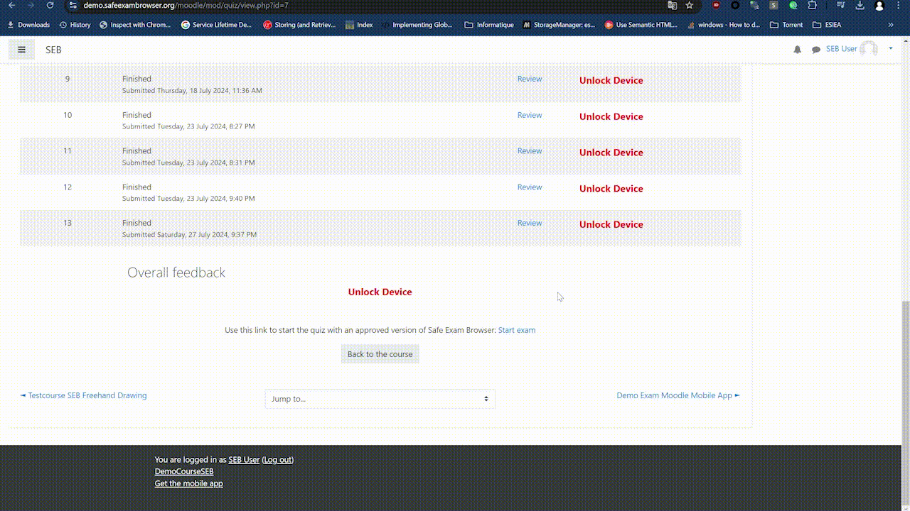

# SEB Bypass

### Description
Chrome extension to bypass the execution of quizzes in Safe Exam Browser (SEB).

The extension works by intercepting your browser requests and modifying HTTP headers.



Discord: cyril13600

### Installation

You have **two options** to install the extension:

1. **Download a built version from releases:**
   - Go to the [releases](https://github.com/cycyrild/SebBypass/releases) page.
   - Download the latest release.

    **Unzip the downloaded file:**
   - Extract the contents of the downloaded file. You should see a folder with a subfolder named `dist`.

    **Load the extension in Chrome:**
   - Open the Chrome browser and navigate to `chrome://extensions/`.
   - Enable "Developer mode" by toggling the switch in the top-right corner.
   - Click on "Load unpacked" and select the `dist` directory which contains the `manifest.json` file.


2. **Build from source:**
   - Clone the repository:
     ```sh
     git clone https://github.com/cycyrild/SebBypass.git
     cd SebBypass
     ```
   - Install the dependencies:
     ```sh
     npm install
     ```
   - Compile the project:
     ```sh
     npm run build
     ```
   - Load the extension in Chrome:
     - Open the Chrome browser and navigate to `chrome://extensions/`.
     - Enable "Developer mode" by toggling the switch in the top-right corner.
     - Click on "Load unpacked" and select the directory where the extension files are located (`dist` folder).


    ### Usage

    To use the Chrome extension, follow these steps:

    1. Click on the extension icon to open the interface.
    2. Click on the "Choose File" button and select your SEB configuration file from your computer.
    3. Once the file is uploaded, the extension will bypass the execution of quizzes in SEB and allow you to take the quiz directly in your current browser.
